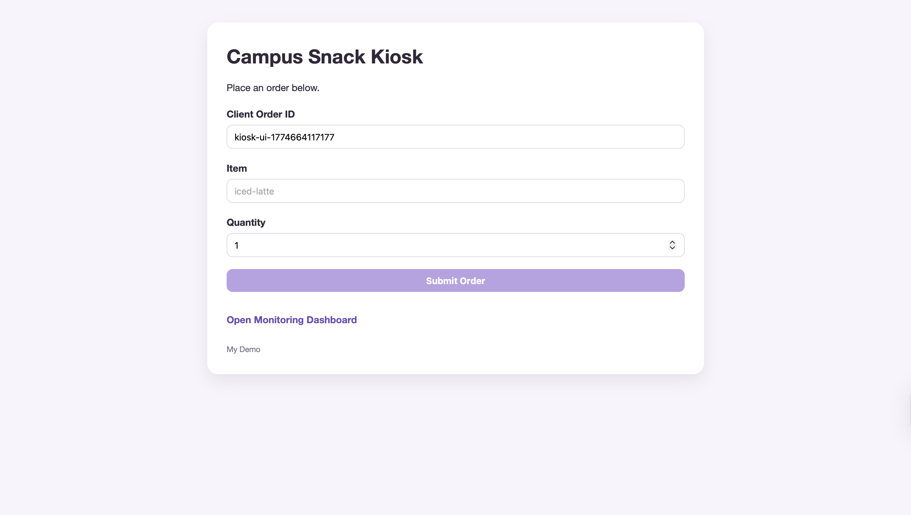
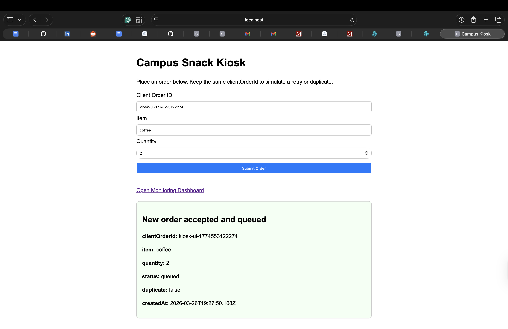
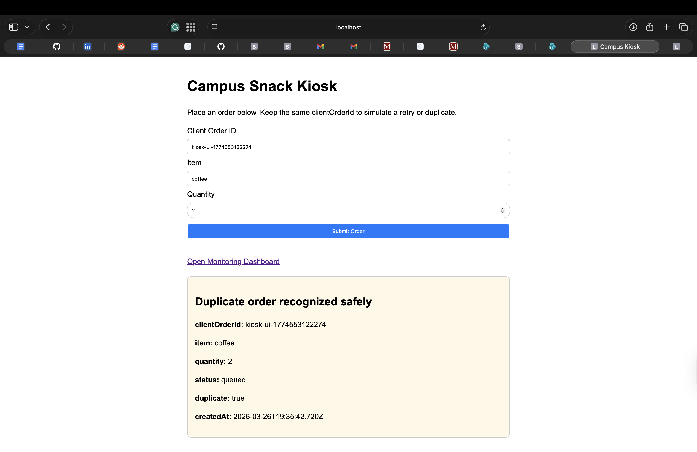
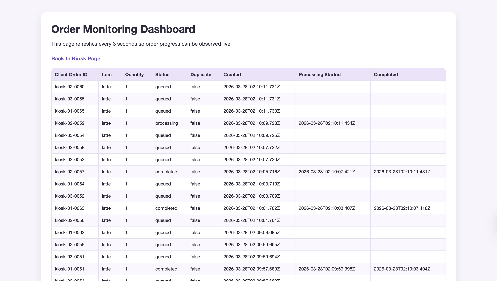
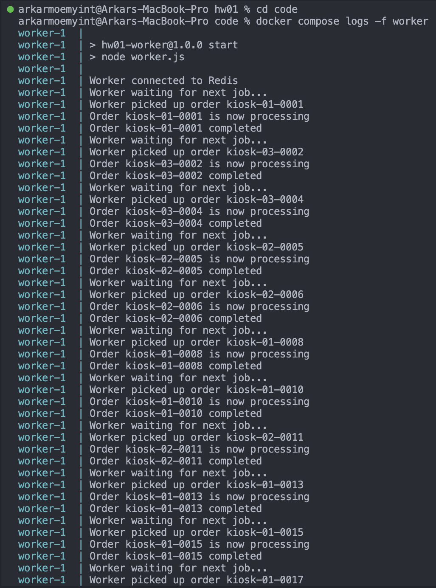
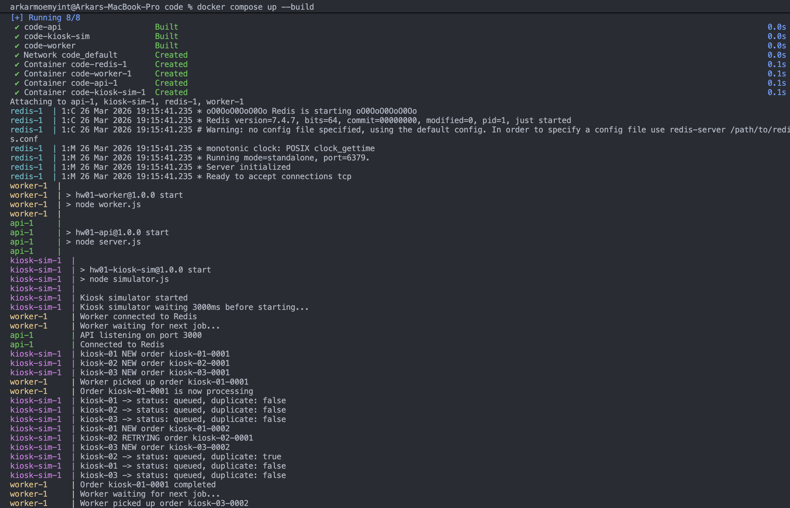

# Homework 01 Implementation Brief

## Student Information

- Name: Arkar Moe Myint  
- UMass Email: amoemyint@umass.edu  
- SPIRE ID: 33859938  

---

## How to Run the Project

From inside the `code/` folder, run:

	docker compose up --build

**The main app is available at:**

	http://localhost:3000

**The monitoring dashboard is available at:**

	http://localhost:3000/dashboard

**To stop the project:**

	Ctrl + C

**or**

	docker compose down

---

## How to Test the Project

**Browser flow**
1.	Open the kiosk page at http://localhost:3000
2.	Submit a new order through the HTML form
3.	Observe the success message showing that the order was accepted
4.	Leave the same clientOrderId unchanged and submit again
5.	Observe that the duplicate submission is recognized safely
6.	Open the monitoring dashboard at http://localhost:3000/dashboard
7.	Watch orders move through queued, processing, and completed

**API flow**

Example new order:

	curl -X POST http://localhost:3000/orders \
	  -H "Content-Type: application/json" \
	  -d '{"clientOrderId":"kiosk-01-0001","item":"coffee","quantity":2}'

Example duplicate retry using the same logical order id:

	curl -X POST http://localhost:3000/orders \
	  -H "Content-Type: application/json" \
	  -d '{"clientOrderId":"kiosk-01-0001","item":"coffee","quantity":2}'

Example status check:

	curl http://localhost:3000/orders/kiosk-01-0001

Logs

Worker logs and kiosk simulator activity can be observed directly in the docker compose up --build output.

---

## Short Architecture Explanation

This project is a small multi-container system with four services:

1. **api**

The API is an Express server. It serves:
	•	the kiosk page at /
	•	the monitoring dashboard at /dashboard
	•	the order endpoints POST /orders and GET /orders/:clientOrderId

It accepts new orders, stores order state in Redis, and queues new work without doing the slow fulfillment work inline.

2. **worker**

The worker runs separately from the API. It waits for queued jobs in Redis, simulates fulfillment with a short delay, and updates order state from queued to processing to completed.

3. **kiosk-sim**

The kiosk simulator runs as a separate service and simulates multiple kiosks sending orders in parallel. It generates unique kiosk-specific order IDs and sometimes intentionally retries an old logical order ID to demonstrate idempotency behavior.

4. **redis**

Redis stores the shared state of the system and the queue of pending jobs.

---

## HTML Request Flow

The kiosk page is a plain HTML form. A user enters:
	•	clientOrderId
	•	item
	•	quantity

The form submits to the server, and the server applies the same order creation logic used by the JSON API. After submission, the page shows whether the order was:
	•	accepted as a new order
	•	recognized as a duplicate retry

The monitoring dashboard is also a plain HTML page. It refreshes automatically every few seconds and shows recent order state so the grader can observe queued, processing, and completed.

---

## Redis Usage

This project uses Redis for both queueing and shared system state.

Queue
	•	queue:orders
	•	Redis list used as the pending job queue

Order state
	•	order:<clientOrderId>
	•	Stores one JSON object for each logical order

Recent order tracking
	•	orders:recent
	•	Stores recent order IDs so the dashboard can render the latest activity

This design keeps the system small and easy to explain while still showing the separation between fast request handling and slower background work.

---

## Kiosk-Sim Design and Environment Variables

The kiosk simulator starts multiple async kiosk loops in parallel.

Each kiosk:
	•	has its own kiosk ID such as kiosk-01
	•	keeps its own local counter
	•	generates IDs such as kiosk-01-0001, kiosk-01-0002, etc.
	•	sometimes retries a previously used ID instead of creating a new one

This makes it easy to observe both concurrent submissions and duplicate retries.

---

## Environment variables used
	•	KIOSK_SIM_API_BASE_URL
	•	base URL of the API service
	•	KIOSK_SIM_KIOSKS
	•	number of kiosks to simulate in parallel
	•	KIOSK_SIM_KIOSK_PREFIX
	•	prefix used for kiosk IDs
	•	KIOSK_SIM_INTERVAL_MS
	•	delay between submissions from each kiosk
	•	KIOSK_SIM_REUSE_EXISTING_ID_RATE
	•	probability that a kiosk retries an old logical order ID
	•	KIOSK_SIM_STARTUP_DELAY_MS
	•	small startup delay so the simulator waits for the API to be ready

⸻

## Idempotency Strategy

My idempotency strategy is enforced at the API boundary.

The client creates the logical order identifier clientOrderId. That identifier remains stable across retries.

Examples:
	•	browser: kiosk-ui-...
	•	simulator: kiosk-01-0001

When the API receives a request:
	1.	it builds a Redis key from clientOrderId
	2.	it checks whether that logical order already exists
	3.	if the order is new, it stores the order state and queues work
	4.	if the order already exists, it returns the existing state instead of queueing duplicate work

Because the same logical order always reuses the same clientOrderId, duplicate retries are recognized safely. This prevents duplicate completed side effects for the same logical order.

The worker also checks existing state before updating an order, so already completed orders are not processed again.

---

## Why the System Is Correct

The API responds quickly because it only validates, stores state, and queues work. It does not simulate fulfillment inline.

The worker processes jobs asynchronously, which creates a visible queue boundary.

The dashboard makes the state transitions observable:
	•	queued
	•	processing
	•	completed

The duplicate retry behavior is safe because the system treats the same clientOrderId as the same logical order instead of a new one.

---

## Setup, Run, Test, and Cleanup Commands

Start

	docker compose up --build

Stop

	docker compose down

Logs

	docker compose logs -f worker
	docker compose logs -f kiosk-sim

Example status check

	curl http://localhost:3000/orders/kiosk-01-0001

---

## Evidence Links

### Screenshots

1. **Kiosk Page**

2. **New Order Accepted**

3. **Duplicate Order Recognized Safely**

4. **Monitoring Dashboard**

5. **Worker Logs (Background Processing)**

6. **Kiosk Simulator Logs (Parallel Activity & Retries)**

---

## Videos
	•	No video included for this submission.

---

## AI Use Statement

I used AI as a development assistant for scaffolding, debugging, and explaining implementation steps for Docker, Express, Redis, the worker loop, the kiosk simulator loop, and the write-up structure.

I still verified the system myself by:
	•	running the full multi-container project
	•	testing the API routes
	•	testing browser form submission
	•	verifying queued, processing, and completed state changes
	•	verifying that duplicate retries with the same clientOrderId did not create duplicate completed work

I understand the code I am submitting and I verified the main behaviors directly through the browser, API responses, logs, and dashboard.

---
